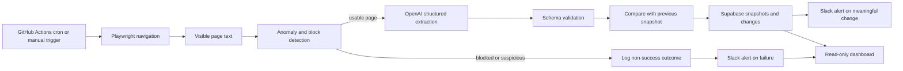

# Autonomous Monitoring Agent

A scheduled monitoring agent that survived a complete redesign of its target pricing page with **zero changes to the agent code**. The resilience comes from extracting the page's visible text with an LLM and validating it against a structured schema, rather than depending on CSS selectors or a fixed DOM hierarchy.

## The problem

Website scrapers often fail silently when a target changes its markup: selectors stop matching, fields become empty, and downstream pricing or competitive intelligence can quietly become stale. That is costly for a business that depends on current information, whether the data is solar and home-services pricing, permit and interconnection status, or another operational signal. A useful monitor needs to detect both meaningful content changes and failures to collect trustworthy data.

## Resilience proof: v1 → v2

The controlled mock target was redesigned from v1 to v2. The layout, class names, and page composition changed, but the visible pricing facts stayed the same. The agent code was not changed between the two versions.

### Before and after snapshot comparison

| Field | v1 before snapshot | v2 after snapshot | Result |
| --- | --- | --- | --- |
| Company | SunPeak Solar | SunPeak Solar | Unchanged |
| Last updated | 2026-08-29T10:45:00-07:00 | 2026-08-29T10:45:00-07:00 | Unchanged |
| Pricing tiers | 4 | 4 | Unchanged |
| Tier names | SunCore 6, SunBalance 8, SunMax 10, SunReserve | SunCore 6, SunBalance 8, SunMax 10, SunReserve | Unchanged |
| Monthly prices | $89/mo, $129/mo, $169/mo, From $219/mo | $89/mo, $129/mo, $169/mo, From $219/mo | Unchanged |
| Features | 16 total feature strings | 16 total feature strings | Unchanged |
| Agent code changes | N/A | 0 | Passed |

The complete structured payloads are available in [docs/before-snapshot.json](docs/before-snapshot.json) and [docs/after-snapshot.json](docs/after-snapshot.json). The structural comparison and limitations are documented in [docs/resilience-proof.md](docs/resilience-proof.md).

This proves the tested claim: a layout-only redesign did not break extraction or create a false pricing change. It does not claim the system will handle every possible redesign, semantic ambiguity, or inaccessible page.

## Architecture



The agent runs every six hours or through `workflow_dispatch`. Playwright captures the full visible text. OpenAI `gpt-4o-mini` returns a function-called payload containing the company name, last-updated value, tier names, prices, and features. The agent validates that payload, compares it with the latest Supabase snapshot, saves the new snapshot, logs field-level changes, and records the run outcome.

A successful run with no changes is a normal no-op. Slack alerts are reserved for real changes after a baseline exists and for non-success outcomes such as `blocked`, `load_failure`, `extraction_failure`, or `anomaly`. This keeps the dashboard and alert channel useful instead of turning every scheduled check into noise.

## Live demo

- Dashboard: [your-dashboard-vercel-url-here.vercel.app](https://your-dashboard-vercel-url-here.vercel.app)
- Mock target: [your-mock-target-vercel-url-here.vercel.app](https://your-mock-target-vercel-url-here.vercel.app)

The dashboard is the main public-facing view. It displays run history, change records, and the v1 → v2 resilience proof.

## Metrics

| Metric | Result | Evidence or status |
| --- | --- | --- |
| v1 → v2 redesign extraction | Passed: same company, timestamp, 4 tiers, prices, and 16 feature strings | [Resilience proof](docs/resilience-proof.md) and before/after snapshots |
| Agent code changes required for v1 → v2 | No: 0 changes to `agent/` for the layout test | Proof documentation and repository history should be used for final audit |
| Successful extraction rate | Pending | No `docs/eval-results.md` or run-log export is committed yet |
| False-positive change detection rate | Pending | Requires a labeled repeated-run evaluation set |
| Time from source change to Slack alert | Pending | Depends on schedule interval and has not been recorded as a measured run metric |
| Alert simulation delivery | Verified locally: 1 change alert and 1 failure alert POSTed | `node index.js --simulate-alert` with a local webhook receiver |

The pending metrics are deliberately not presented as zero. They need a defined evaluation window, labeled cases, and recorded timestamps before they can support a stronger claim.

## Design decisions and tradeoffs

### A mock target instead of a real company site

The target is fictional and controlled. That avoids Terms of Service, robots-policy, privacy, and brand-confusion concerns that would come with scraping a real competitor's site. It also gives the evaluation a known source of truth: the page can be deliberately redesigned while keeping the pricing facts constant, making the resilience test repeatable and easy to inspect.

The tradeoff is realism. A mock target cannot represent every behavior of a production website, such as localization, JavaScript-rendered pricing, consent flows, regional prices, authentication, or inconsistent copy.

### LLM extraction instead of selectors

Selectors are precise and inexpensive when a DOM contract is stable, but they are coupled to markup. This project instead captures visible text and asks an LLM for a strict structured payload. That makes the tested v1 → v2 redesign survivable because the extraction focuses on human-readable content rather than the page's implementation details.

The tradeoff is cost, latency, and probabilistic interpretation. Schema validation catches missing or malformed fields, but it cannot guarantee that an ambiguous sentence was interpreted correctly. A production system would benefit from confidence checks, domain-specific validation, and a larger labeled evaluation set.

### Alert and back off instead of evasion

When the page looks blocked or suspicious, the agent logs the outcome, alerts the operator, and stops after its limited retry policy. It does not attempt to bypass CAPTCHA, evade rate limits, or disguise its traffic. That is the correct operational and ethical boundary for a monitoring system: a blocked source is an explicit state that needs review, not an invitation to build a more aggressive scraper.

### Known limitations

This is a resilience proof for one controlled layout redesign, not a universal scraper benchmark. The anomaly detector is intentionally classifier-like and pattern-based; it can miss unfamiliar challenge pages or conservatively classify unusual content as suspicious. The LLM can also return a plausible but incorrect value when page wording is ambiguous. The current repository does not yet contain enough labeled runs to report an extraction rate, false-positive rate, or measured alert latency. Those are the next evaluation improvements, not numbers to infer from the single v1 → v2 case.

This checkout also does not include production credentials or confirmed deployment URLs. During the end-to-end verification pass, the local `.env` values were placeholders, so a real OpenAI/Supabase-backed run and live dashboard data could not be independently re-run from this workspace. The deployed URLs and repository Actions secrets need to be confirmed in the hosting and GitHub environments before treating the public demo as independently verified.

## Portfolio connection

This project is the monitoring layer around the information that other automation systems depend on. In the broader portfolio, keeping pricing and competitive data current is what allows a voice qualification workflow such as Project 1 and a RAG pricing assistant such as Project 3 to work from trustworthy outside-world inputs instead of silently aging snapshots. The connection is architectural and intended: this repository demonstrates how those inputs can be watched, validated, and surfaced when they change. It does not claim a live production integration with those projects unless their deployed interfaces are connected separately.

## Repository structure

```text
.
├── agent/
│   ├── scrape.js             # Playwright navigation and visible text capture
│   ├── detect-anomaly.js     # Block and suspicious-page detection
│   ├── extract.js            # OpenAI structured pricing extraction
│   ├── diff.js               # Snapshot comparison and field-level changes
│   ├── supabase.js           # Snapshot, change, and run persistence
│   ├── alert.js              # Slack Incoming Webhook alerts
│   ├── index.js              # End-to-end orchestration
│   └── README.md             # Full agent setup and operation notes
├── dashboard/                # Next.js read-only monitoring dashboard
├── mock-target/              # Controlled fictional pricing page and source data
├── docs/
│   ├── before-snapshot.json  # v1 baseline payload
│   ├── after-snapshot.json   # v2 payload
│   └── resilience-proof.md   # Detailed redesign proof
└── .github/workflows/
    └── monitor.yml           # Six-hour schedule and manual workflow
```

## Local setup

The agent requires Node.js 20+, an OpenAI API key, Supabase credentials, the deployed mock-target URL, and a Slack Incoming Webhook URL. From the agent directory:

```powershell
cd "C:\Users\mrahe\Downloads\Autonomous Monitoring\agent"
npm install
npx playwright install chromium
copy .env.example .env
npm run start
```

Add the real values to `.env`; never commit that file. For the complete local workflow, simulation flags, Supabase schema expectations, Slack setup, and GitHub Actions secrets, see [agent/README.md](agent/README.md).
